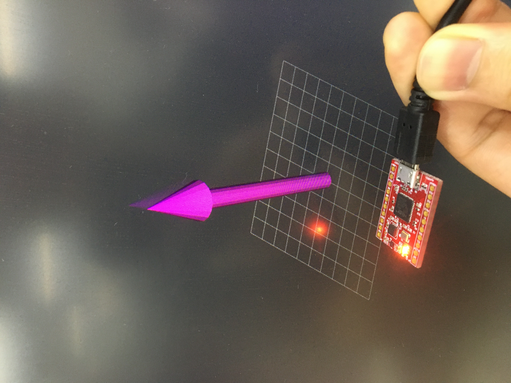

# myahrs_ros2_driver

[](https://opensource.org/licenses/Apache-2.0)

|  ROS2      | foxy   | galactic
|:-------:|:-------:|:-------:|
| Branch  | [`foxy-devel`](https://github.com/clobot-git/myahrs_ros2_driver/tree/foxy-devel) | TBD
| CI  | Linux: [](https://travis-ci.com/github/clobot-git/myahrs_ros2_driver/builds)| TBD |

## Overview

This package is a ROS2 driver for the myAHRS+ which is a low cost high performance AHRS(Attitude Heading Reference System). Using this package, users can create the format of IMU sensor_msgs(http://docs.ros.org/en/melodic/api/sensor_msgs/html/msg/Imu.html) in ROS2 system. If install the visualization_tutorials package, users can visualize the IMU snesor data using the RVIZ2.


### Original Source

The original source of the myahrs_driver belongs to WITHROBOT. This package used the myAHRS+ SDK below.

https://github.com/withrobot/myAHRS_plus


## Installations

Install the package:

```sh
mkdir -p ~/myahrs_ws/src && cd ~/myahrs_ws/src
git clone https://github.com/clobot-git/myahrs_ros2_driver.git
cd ~/myahrs_ws/
colcon build
```

### Install visualization_tutorials

Users can use the RVIZ2 visualization package:

```sh
git clone -b clobot-devel --single-branch https://github.com/clobot-git/visualization_tutorials.git
```

## Run

First, serial port(/dev/ttyACM0) permissions must be granted to the /root.

Run the following command:

```sh
ros2 launch myahrs_ros2_driver myahrs_ros2_driver.launch.py
```

