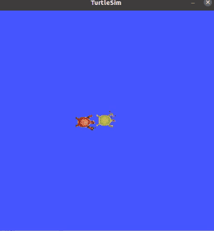

## gcamp-ros2-seminar

마곡 AI 로봇 해커톤 中 `ROS 2(Robot Operating System)` 로봇 제작 기술워크숍 세미나 자료

> Seminar link : [Seoul MakerSpace G Camp](https://www.g.camp/2257)

## Running Environment

* Jetson Nano 4GB Dev Kit
* Jetpack 4.6
* ROS 2 Eloquent

# ROS 2 Basic Examples

This Repo contains mainly two parts.

* ROS 2 Basic & `rclpy`  Programming Examples => *basic_topic_pkg*
* ROS 2 autonomous Robot based on Popular RC Car => *MaRo*

### 1) ROS 2 Basic Programming0

There's 6 rclpy scripts for Node programming, And also 3 for Topic programming

1. My First ROS 2 Node.
2. Run Node periodically by `create_timer`.
3. About `rclpy.spin`.
4. ROS 2 Node Composition.
5. Node Composition with `create_timer`.
6. ROS 2 Node logger level.

**How to Run**
```
ros2 run basic_topic_pkg example_node_<number>
```

Moreover, There's 3 rclpy scripts for ROS 2 Topic programming.

1. Publish `cmd_vel` message to `turtlesim` through topic publisher
2. Subscribe turtlesim's `pose` message and analize about message type.
3. Small Project, Make `turtle2` mimic `turtle1` using publisher & subscriber both.

<p align="center">
    
</p>


**How to Run**
```
ros2 run basic_topic_pkg topic_pub_node
ros2 run basic_topic_pkg topic_sub_node
ros2 run basic_topic_pkg topic_pub_sub_node
```

---
# MaRo

<p align="center">
    
    
</p>

## Setup - Hardware

There's Full BOM for MaRo in `Parts` folder.
And also you can find custom `stl`, `dxf` files in there.

<p align="center">
    
</p>

Lastly, Even there's Assembly Guide for MaRo. Please refer [this](https://puzzling-cashew-c4c.notion.site/a457025c8bb843b188a976b3189c3882) notion page.


## Setup - Software

All Setups are prepared through shell scripts.
Just Run that 😁

Shell Scripts in `Setup` Folder
* `ai_demo_setup.sh` => Install prerequisites for ROS 2 Deep Learning Node 
* `parts_install.sh` => Install python3 packages control RC Car 
* `ros2_setup.sh` => Install ROS 2 onto Jetpack 4.6 
* `utils_setup.sh` => Install few usefull utilities / Setup aliases for developing
* `vscode_install.sh` => Install VSCode for Jetpack 4.6 

Most of above scripts are referneced from [JetsonHacks](https://www.jetsonhacks.com/)

> Always Thank you, Mr. Jim !!

## Run Examples

* RQT Control Plugin
* 2D Lidar to odometry
* 2D Lidar SLAM (slam_toolbox)
* Autonomous Driving with `Nav 2`

### TODO

- [ ] Fully support for Nav 2
- 